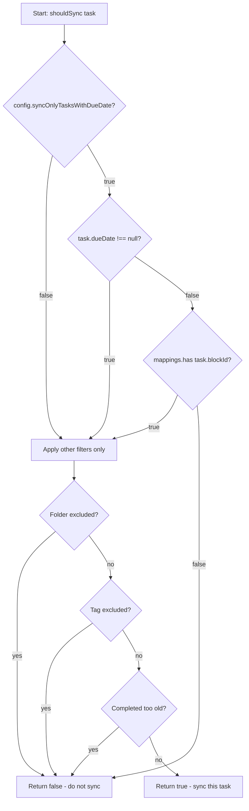

# Data Model: Due Date Filter for Task Synchronization

**Feature**: 004-sync-due-date-only
**Date**: 2026-02-02
**Status**: Complete

---

## Overview

This document defines the data model changes required to implement the due date filter feature. The feature introduces minimal model changes - a single boolean configuration field that controls filtering behavior.

---

## Entities

### 1. CalDAVConfiguration (Modified)

**Location**: `src/types.ts`

**Purpose**: Plugin configuration settings, including the new due date filter toggle.

**TypeScript Interface**:
```typescript
export interface CalDAVConfiguration {
  // === Existing Fields (unchanged) ===
  serverUrl: string;           // CalDAV server URL (HTTPS required)
  username: string;            // CalDAV authentication username
  password: string;            // Password (stored securely via Obsidian API)
  calendarPath: string;        // Path to target calendar on server
  syncInterval: number;        // Auto-sync interval in seconds (default: 60)
  enableAutoSync: boolean;     // Enable automatic background syncing
  excludedFolders: string[];   // Vault folders to exclude from sync
  excludedTags: string[];      // Inline tags to exclude from sync
  completedTaskAgeDays: number;// Age threshold for completed tasks (default: 30)
  enableDebugLogging: boolean; // Debug mode toggle

  // === New Field ===
  syncOnlyTasksWithDueDate: boolean; // ⭐ NEW: Filter tasks by due date presence
}
```

**Field Details**:

| Field | Type | Default | Validation | Description |
|-------|------|---------|------------|-------------|
| `syncOnlyTasksWithDueDate` | boolean | `false` | None needed | When true, only sync tasks with due dates (exception: previously synced tasks continue to sync) |

**Validation Rules**:
- None required (boolean type is self-validating)
- Default value ensures backward compatibility

**State Transitions**:
- `false` → `true`: User enables filter; subsequent syncs apply filtering
- `true` → `false`: User disables filter; all tasks sync normally (including previously excluded tasks)

**Storage**:
- Persisted in Obsidian's `data.json` via plugin data API
- Loaded on plugin startup
- Saved immediately on setting change

---

### 2. Task (Unchanged)

**Location**: `src/types.ts`

**Purpose**: Represents an Obsidian task with metadata needed for sync evaluation.

**TypeScript Interface**:
```typescript
export interface Task {
  blockId: string;                  // UUID block reference (task-xxx)
  filePath: string;                 // Vault-relative file path
  lineNumber: number;               // 1-indexed line in file
  description: string;              // Clean task text (dates/refs removed)
  dueDate: Date | null;            // ⭐ USED BY FILTER: Parsed from 📅 YYYY-MM-DD
  status: TaskStatus;              // "open" or "completed"
  rawLine: string;                 // Original markdown line
  tags: string[];                  // Inline tags (#work, #personal, etc.)
  completionDate: Date | null;     // Parsed from ✅ YYYY-MM-DD
}
```

**Relevance to Feature**:
- `dueDate` field is checked to determine if task has a due date
- `blockId` field is checked to determine if task was previously synced
- **No changes to Task interface required**

---

### 3. SyncMapping (Unchanged)

**Location**: `src/sync/mapping.ts`

**Purpose**: Links Obsidian tasks to CalDAV entries, tracks sync state.

**TypeScript Interface**:
```typescript
export interface SyncMapping {
  blockId: string;                  // ⭐ USED BY FILTER: Identifies previously synced tasks
  caldavUid: string;               // CalDAV server UID
  lastSyncTimestamp: Date;         // Last successful sync time
  lastKnownContentHash: string;    // Hash of task content (for change detection)
  lastKnownObsidianModified: Date; // Last known Obsidian modification time
  lastKnownCalDAVModified: Date;   // Last known CalDAV modification time
  caldavEtag: string;              // Server ETag (for optimistic concurrency)
  caldavHref: string;              // Full URL to VTODO resource
}
```

**Relevance to Feature**:
- Existence of a mapping for a given `blockId` indicates "previously synced"
- **No changes to SyncMapping interface required**

---

## Filter Logic Data Flow

### Input Data
```typescript
{
  task: Task,                         // Task to evaluate
  config: CalDAVConfiguration,        // Plugin settings
  mappings: Map<string, SyncMapping>  // Existing sync mappings
}
```

### Filter Decision Tree



### Output
- `boolean` - true if task should be synced, false otherwise

---

## Data Relationships

```
┌─────────────────────────────────┐
│   CalDAVConfiguration           │
│  (Plugin Settings)              │
│                                 │
│  + syncOnlyTasksWithDueDate ◄───┼─── Controls filter behavior
│  + excludedFolders              │
│  + excludedTags                 │
│  + completedTaskAgeDays         │
│  + ... other settings           │
└─────────────────────────────────┘
                  │
                  │ read by
                  ▼
┌─────────────────────────────────┐     ┌────────────────────────┐
│   Filter Function               │     │   Task                 │
│   shouldSync()                  │◄────┤   (from vault scan)    │
│                                 │     │                        │
│   Input:                        │     │   + blockId            │
│   - Task                        │     │   + dueDate  ◄─────────┼─── Checked by filter
│   - CalDAVConfiguration         │     │   + filePath           │
│   - Map<blockId, SyncMapping>   │     │   + tags               │
│                                 │     │   + status             │
│   Output: boolean               │     │   + ...                │
└─────────────────────────────────┘     └────────────────────────┘
                  │                                  │
                  │                                  │
                  │ uses                         has │
                  ▼                                  ▼
┌─────────────────────────────────┐     ┌────────────────────────┐
│   SyncMapping Store             │     │   blockId              │
│   Map<blockId, SyncMapping>     │     │   (unique identifier)  │
│                                 │     └────────────────────────┘
│   Key: blockId                  │                  │
│   Value: SyncMapping            │◄─────────────────┘
│                                 │
│   Purpose: Identify previously  │
│   synced tasks                  │
└─────────────────────────────────┘
```

---

## Validation Rules

### Configuration Validation

**syncOnlyTasksWithDueDate**:
- Type: `boolean`
- Default: `false`
- Valid values: `true` | `false`
- No additional validation needed (TypeScript type system enforces)

### Runtime Validation

**Due Date Presence Check**:
```typescript
// Presence check (not format validation)
const hasDueDate = task.dueDate !== null;
```
- Relies on parser to validate format during vault scan
- Filter only checks for presence/absence
- Invalid dates are treated as "no due date" (fail-safe)

**Sync Mapping Existence Check**:
```typescript
// O(1) hash lookup
const hasSyncMapping = task.blockId ? mappings.has(task.blockId) : false;
```
- If `blockId` is empty/undefined → no mapping
- Map lookup is safe (returns false for non-existent keys)

---

## State Transitions

### Task Sync State Machine

```
┌──────────────────┐
│   UNTRACKED      │  Task has no blockId
│   (never synced) │
└────────┬─────────┘
         │
         │ First sync creates blockId + mapping
         ▼
┌──────────────────┐
│   TRACKED        │  Task has blockId + mapping exists
│   (synced)       │
└────────┬─────────┘
         │
         │ User removes due date
         ▼
┌──────────────────┐
│   TRACKED        │  Still has mapping → continues to sync
│  (no due date)   │  (filter exception applies)
└──────────────────┘
```

**Filter Impact on States**:

| Task State | Has Due Date | Has Mapping | Filter=OFF | Filter=ON |
|------------|--------------|-------------|------------|-----------|
| Untracked  | Yes          | No          | ✅ Sync    | ✅ Sync   |
| Untracked  | No           | No          | ✅ Sync    | ❌ Skip   |
| Tracked    | Yes          | Yes         | ✅ Sync    | ✅ Sync   |
| Tracked    | No           | Yes         | ✅ Sync    | ✅ Sync (exception) |

---

## Data Persistence

### Settings Storage

**File**: `<vault>/.obsidian/plugins/caldav-task-sync/data.json`

**Format**:
```json
{
  "version": 1,
  "settings": {
    "serverUrl": "https://caldav.example.com",
    "username": "user@example.com",
    "password": "",
    "calendarPath": "/calendars/user/tasks/",
    "syncInterval": 60,
    "enableAutoSync": true,
    "excludedFolders": ["Archive"],
    "excludedTags": ["#someday"],
    "completedTaskAgeDays": 30,
    "enableDebugLogging": false,
    "syncOnlyTasksWithDueDate": false
  },
  "syncState": {
    "mappings": {
      "task-abc123": {
        "caldavUid": "uid-xyz789",
        "lastSyncTimestamp": "2025-02-01T12:00:00Z",
        "lastKnownContentHash": "hash123",
        "caldavEtag": "etag456",
        "caldavHref": "/calendars/user/tasks/uid-xyz789.ics"
      }
    }
  }
}
```

**Migration**: None required - missing fields default to `false`

**Backward Compatibility**: Old data.json files without `syncOnlyTasksWithDueDate` will load with default `false` (no behavior change)

---

## Performance Characteristics

### Memory Overhead
- **New field**: 1 byte (boolean in memory)
- **Total config object**: ~500 bytes (unchanged impact)

### Computational Complexity

**Filter evaluation per task**:
```typescript
// Worst case: O(1) operations
if (config.syncOnlyTasksWithDueDate) {         // O(1) - boolean read
  const hasDueDate = task.dueDate !== null;    // O(1) - null comparison
  const hasMapping = mappings.has(task.blockId); // O(1) - Map lookup
  if (!hasDueDate && !hasMapping) return false;  // O(1) - boolean logic
}
```

**Total**: O(1) per task

**At scale (1000 tasks)**: <0.1ms total overhead

---

## Type Safety

### TypeScript Strict Mode Compliance

All interfaces use strict null checks:

```typescript
// Explicit null types
dueDate: Date | null;           // Can be null (no due date)
blockId: string;                // Always present (may be empty string)
syncOnlyTasksWithDueDate: boolean; // Always boolean (never undefined)
```

### Null Safety Patterns

```typescript
// Safe due date check
if (task.dueDate !== null) {
  // TypeScript narrows type to Date here
  const formatted = task.dueDate.toISOString();
}

// Safe blockId check
if (task.blockId && mappings.has(task.blockId)) {
  // TypeScript knows blockId is truthy here
  const mapping = mappings.get(task.blockId)!; // Non-null assertion safe
}
```

---

## Summary of Changes

### Modified Entities
1. **CalDAVConfiguration** - Add `syncOnlyTasksWithDueDate: boolean` field

### Unchanged Entities
1. **Task** - No changes (existing `dueDate` and `blockId` fields are sufficient)
2. **SyncMapping** - No changes (existing mapping system is sufficient)

### New Validation Rules
- None (boolean type is self-validating)

### New State Transitions
- None (leverages existing sync state machine)

### Migration Required
- None (backward compatible with default value)

---

**Data Model Status**: ✅ Complete
**Next Step**: Generate API contracts
